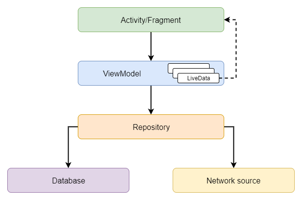
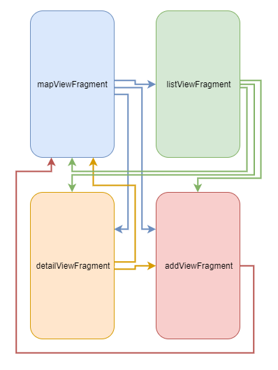

# PRACA DYPLOMOWA INŻYNIERSKA
POLITECHNIKA WROCŁAWSKA  
WYDZIAŁ ELEKTRONIKI  
KIERUNEK: INFORMATYKA  
SPECJALNOŚĆ: SYSTEMY I SIECI KOMPUTEROWE  
Aplikacja mobilna na platformę Android umożliwiająca użytkowanie i uzupełnianie tworzonej społecznościowo bazy danych geoprzestrzennych
Mobile application for the Android platform facilitating use of and contribution to a crowdsourced geospatial database  
AUTOR: Bartosz Rodziewicz  
PROWADZĄCY PRACĘ: Dr inż. Paweł Trajdos, W4/K2  

## Spis treści
1. Wstęp
1. Opis koncepcji
1. Wybrane technologie
	1. Język
	1. Zewnętrzne biblioteki
	1. API
	1. Komunikacja z serwerem
	1. Środowisko deweloperskie
	1. Kontrola wersji
	1. System budowania
1. Dokumentacja i opis implementacji
1. Opis interfejsu użytkownika
1. Podsumowanie

Literatura  
<!--Indeks rycin/listingów-->

<!--(jezyk, zewnętrzne biblioteki, api (application programming interface), metoda komunikacji z serwerem, środowisko, kontrola wersji, system budowania)-->

## Wstęp
W dzisiejszych czasach praktycznie każdy posiada smartfon. Większość z nich jest wyposażona, najczęściej w stałe, połączenie z Internetem. Pozwoliło to na wykształcenie się na rynku wielu aplikacji, których celem jest pomoc użytkownikowi w znalezieniu konkretnych informacji, w tym również geolokalizacyjnych. Istnieje wiele aplikacji oferujących dostęp do map, ułatwiających znajdywanie firm, wyświetlających aktualne położenie autobusów komunikacji miejskiej czy umożliwiających zlokalizowanie publicznych toalet w okolicy.

Celem tej pracy było przygotowanie aplikacji na urządzenia z systemem Android umożliwiającej użytkownikom na łatwiejsze znajdywanie miejsc użyteczności publicznej, gdzie goście mają dostęp do energii elektrycznej, np. restauracji, w której można usiąść przy stoliku z laptopem i podłączyć się do prądu. Aplikacja miała być klientem do niezależnie rozwijanego serwera z bazą danych i oferować możliwość wyświetlania zebranych w niej danych oraz umożliwiać operowanie na nich w przystępny i szybki dla użytkownika sposób.

Program ten miał być pisany wykorzystując najlepsze wzorce projektowe oraz odpowiednią warstwę abstrakcji, tak by jego dalszy rozwój był łatwy, nawet dla innej osoby. Dodatkowo miało to umożliwić łatwą zmianę przechowywanych danych w bazie, jeśli w przyszłości byłaby taka konieczność bądź chciano by wykorzystać ten projekt do stworzenia aplikacji podobnego typu.

Rozdział 1 stanowi wstęp do problemu. Rozdział 2 bardziej szczegółowo opisuje koncepcję aplikacji, jej zastosowanie i to co zostało zrealizowane. Rozdział 3 przedstawia technologie wybrane do stworzenia programu. Rozdział 4 opisuje aspekty implementacji kodu oraz stanowi jego dokumentację. Rozdział 5 został wykorzystany do prezentacji i opisania interfejsu użytkownika aplikacji. W rozdziale 6 zamieszono podsumowanie pracy. Na końcu dokumentu znajdują się odwołania do literatury, z której korzystano w trakcie przygotowywania tej pracy.

## Opis koncepcji
### Aplikacja mobilna
Pomysł na aplikację powstał obserwując inne aplikacje użytkowe, jak te wymienione we wstępie. Głównie była ona bazowana na dwóch aplikacjach - aplikacji do wyszukiwania publicznych toalet (Flush) oraz publicznych sieci Wi-Fi (WiFi Map). W obu przypadkach głównym punktem wokół kręci się cała idea jest mapa z społecznie zbieranymi danymi przez użytkowników, którzy w założeniu sami dbają o poprawność i aktualność danych.

Tutaj też głównym miejscem miał być widok mapy umożliwiający w przyjazny dla użytkownika sposób przeglądanie danych. Dodatkowo dane miały być możliwe do wyświetlenia w kwestii listy, sortowanej rosnąco odległością od użytkownika.

Aby zmniejszyć obciążenie urządzenia oraz umożliwić pracę na dużej bazie danych klient miał pobierać punkty znajdujące się blisko lokalizacji użytkownika oraz te znajdujące się w zakresie widoku mapy, przeglądanej przez użytkownika. Z uwagi, że aplikacja prezentuje rzadko zmieniające się dane zmniejszenie zapytań do serwera miało być wykorzystane przez zapewnienie metody na buforowanie wyników zapytań na urządzeniu na jakiś czas, bądź do sytuacji gdy aplikacja przekroczy dozwolony rozmiar pamięci buforu. Aplikacja miała również oferować ręczne sterowanie, który obszar będzie zapisany lokalnie na urządzeniu, aby umożliwić dostęp do danych w trybie offline.

Baza miała przechowywać podstawowe dane o miejscu, jak jego lokalizacja, czy nazwa oraz bardziej specyficzne dla tego zastosowania dane, jak ilość publicznie dostępnych gniazdek, czy szkic poglądowy z zaznaczonymi gniazdkami na planie budynku (co np. w przypadku restauracji ułatwiło by klientowi wybranie odpowiedniego stolika, bez konieczności pytania obsługi). Planowana była też szersza integracja z Google Maps, aby miejsca w aplikacji można było przypisać do punktów POI (_Points of interests_) znajdujących się w tym serwisie.

W aplikacji miał być dostępny widok szczegółowy danego miejsca umożliwiający podejrzenie dodatkowych informacji o danym miejscu oraz historię ostatnich modyfikacji tego miejsca. Widok dodawania nowego miejsca miał umożliwić podanie wszystkich szczegółów dotyczących tego miejsca oraz miał ułatwiać naszkicowanie planu budynku ręcznie bądź umożliwić wgranie zdjęcia ręcznie wykonanego planu.

Klient miał oczywiście pozwalać również na edycje już istniejących punktów, jak i usuwanie błędnie stworzonych, bądź już nie istniejących. Planowane było też wprowadzenie kont użytkownika, aby śledzić kto dokonuje modyfikacji, oraz zablokować tych, którzy pogarszają jakość danych w aplikacji.

### Serwer

Do działania aplikacja potrzebowała by również internetowego serwera z bazą danych, jednak nie stanowi to przedmiotu tej pracy. Serwer miał być napisany w sposób umożliwiający tej aplikacji na połączenie się z nim oraz wykorzystując odpowiednią warstwę abstrakcji, by w przyszłości było możliwe stworzenie klientów na inne platformy (klient webowy, na system iOS, itp.)

### Zakres realizacji

Oczywiście powyższy opis konceptu przekracza to co było planowane w zakresie tej pracy, oraz przekracza to co udało się zrealizować. W trakcie realizacji pracy udało się stworzyć następujące funkcjonalności:

* Możliwość przeglądania punktów w formie mapy i listy
* Możliwość dodawania, edycji i usuwania punktów
* Możliwość przeszukiwania bazy danych
* Połączenie z serwerem i synchronizacja danych
* Zapisywanie danych z serwera na urządzeniu, aby zminimalizować ilość zapytań

Jest to całkiem solidny zakres podstawowych funkcji umożliwiający na używanie aplikacji w założonych celach i jej dalszy rozwój.

## Wybrane technologie
### Platforma
Z punktu widzenia projektu wybór platformy mobilnej był jedynym słusznym wyborem, ponieważ aplikacja dostarcza informacje, które użytkownikom są potrzebne gdy są w biegu, a nie siedzą w zaciszu swojego domu przed komputerem. Na rynku platform mobilnych aktualnie istnieje jedynie dwójka graczy, czyli Android od firmy Google, oraz iOS od firmy Apple, mając udziały w rynku odpowiednio 77% i 22%. Z tych danych wychodzi jasny obraz, że aby dotrzeć do jak największej liczby użytkowników należy wybrać platformę Android. Dodatkowym aspektem skłaniającym do wyboru tej platformy był fakt posiadania przez autora pracy urządzeń działających pod kontrolą tego systemu.

### Język programowania
Wybór platformy w dużej mierze uwarunkował wybór języka programowania. Istnieją oczywiście różne metody by pisać na Androida w wielu różnych językach (np. COBOL), jednak oficjalnie wspierane są następujące języki:
* Kotlin - nowy język, działający w JVM i będący w pełni interoperacyjny z Javą; od niedawna zalecany jako główny język dla nowych aplikacji przez Google
* Java - standardowy język, w którym od dawna powstają aplikację na tą platformę
* C++ - istnieje możliwość wykorzystania bibliotek napisanych w C++ za pomocą NDK udostępnionego przez Google, przydatne przy oprogramowaniu dla którego kluczowa jest wydajność, czyli np. gier
* HTML+CSS+JS - częściowo wspierane jest tworzenie nowoczesnych stron internetowych zachowujących się jako aplikacje wykorzystując PWA

Taka sytuacja sprowadza się do wyboru pomiędzy dwoma językami: Kotlinem i Javą. Mimo pewnego wcześniejszego doświadczenia autora pracy z Javą wybrany został język Kotlin, który jest traktowany przez Google jako przyszłość dla tej platformy, aby ułatwić w przyszłości rozwój tej aplikacji i poznać nieznaną dotąd dla siebie technologię.

### Zewnętrzne biblioteki
Przy budowie projektu wykorzystano kilka zewnętrznych bibliotek, z których większość wchodzi w skład Android Framework, czyli oficjalnych bibliotek wymaganych do tworzenia aplikacji na tą platformę.

Podstawową użytą biblioteką jest biblioteka języka Kotlin, pozwalająca na pisanie kodu w tym języku oraz biblioteka Core z pakietu AndroidX, czyli główna biblioteka wymagana przez system, implementująca podstawowe definicje takich elementów jak aktywności, czy widoki programu. Większość widoków w aplikacji stworzono wykorzystując ConstraintLayout, którego podstawowa definicja znajduje się w bibliotece o tej samej nazwie.

Przy tworzeniu wykorzystano również bibliotekę AppCompat, która pozwoliła na modyfikacje paska akcji na górze widoku aplikacji i implementację mechanizmu wyszukiwania miejsc.

Do wsparcia przy budowie nawigacji pomiędzy ekranami programu wykorzystano bibliotekę o nazwie Navigation, ponieważ jest to zalecona metoda tworzenia przejść przez Google. Z tego samego powodu wykorzystano bibliotekę Lifecycle do lepszego wsparcia zarządzania życiem poszczególnych elementów aplikacji.

W programie zaimplementowano bazę danych w technologii SQLite wykorzystując bibliotekę Room, która pozwala w prosty sposób tworzyć bazy danych do aplikacji na platformę Android.

Do obsługi map oraz lokalizacji wykorzystano biblioteki Google Maps Services, ponieważ jest to oficjalnie wspierana biblioteka do tych zastosowań.

<!-- biblioteka do neta -->

Jedyną użytą biblioteką nie wchodzącą w skład Android Framework, jest biblioteka Timber, która znacząco ułatwia korzystanie z systemowych logów platformy Android.

### API
### Komunikacja z serwerem
### Środowisko deweloperskie
Projekt realizowany był z użyciem komputera wyposażonego w procesor Intel Pentium G3258@4.4GHz, 16GB pamięci RAM DDR3-1333 oraz kartę graficzną AMD Pitcairn XT na karcie Radeon HD 7870 z 2 GB pamięci, pracujący pod kontrolą systemu operacyjnego Microsoft Windows 10 Pro w wersji 1903 (Build 18362.476).

Główny telefon wykorzystany do projektu to OnePlus 5T posiadający układ Snapdragon 835 i 6GB pamięci operacyjnej działający pod kontrolą systemu Android w wersji 9 Pie z nakładką OxygenOS w wersji 9.0.9.

Program kompilowany był z użyciem Kotlina w wersji 1.3.60 do kodu bajtowego zgodnego z JVM w wersji 1.6. Proces budowania był sterowany przez narzędzie Gradle w wersji 5.4.1 z wtyczką do Androida (Android Gradle Plugin) w wersji 3.5.1. Kod edytowany był w środowisku deweloperskim (IDE) Android Studio w wersji 3.5.2.

Najniższa wspierana przez aplikację wersja systemu Android to 5.0 Lollipop. Oprogramowanie było kompilowane używając SDK w wersji 29, odpowiadającej najnowszej wersji Androida 10.

Aplikacja została przetestowana również na następujących urządzeniach:

* OnePlus One - Android 9 Pie
* Xiaomi Redmi Note 5A Prime - Android 7.1.2 Nougat
* Nokia 8 - Android 9 Pie
* Samsung Galaxy Tab 8.4 Pro - Android 7.1.2 Nougat (tablet)
* Nexus 5X - Android 10 (maszyna wirtualna)
* Nexus 4 - Android 5.0 Lollipop (maszyna wirtualna)

Na każdym z wymienionych urządzeń aplikacja działała w pełni poprawnie.

### Kontrola wersji
W większości projektów informatycznych narzędzia systemu kontroli wersji pomagają zachować porządek i ułatwiają nad nim pracę. Z tego też powodu ten projekt również wykorzystywał narzędzie tego rodzaju - Git.

Repozytorium Git wykorzystywane było głownie, aby lepiej zorganizować zmiany i łatwiej się w nich odnajdywać. Pozwalało na jednoczesną pracę nad kilkoma funkcjonalnościami jednocześnie, zachowując uporządkowaną historię zmian. Dodatkowo zabezpieczało ono sprawnie działający kod, pozwalając na cofnięcie niechcianych zmian w każdej chwili używając jednej komendy. System ten zapewniał też swojego rodzaju kopię zapasową projektu, ponieważ poza lokalnym komputerem repozytorium trzymane było również na serwerze GitHub w formie prywatnego projektu.

### System budowania
Do automatyzacji procesu budowania wykorzystano narzędzie Gradle. Pozwalało ono po sprecyzowaniu podstawowych ustawień na w pełni automatyczne tworzenie pliku apk gotowego do instalacji na urządzeniu.

W przypadku projektów na platformę Android konfiguracja gradle, podzielona jest na dwa osobne pliki - konfiguracja do całego projektu oraz poszczególnego modułu. Mimo, że projekt posiadał tylko jeden moduł, zachowany został ten podział, ponieważ uważany jest on za dobrą praktykę.

W pliku z konfiguracją na cały projekt podane zostały zdalne repozytoria, z których Gradle pobierał wymagane dependencje oraz zdefiniowane zostało użycie narzędzi wymaganych do zbudowania aplikacji na system Android.

W pliku konfiguracyjnym modułu programu znajdowały się podstawowe ustawienia.

```
compileSdkVersion 29
dataBinding {
	enabled = true
}
androidExtensions {
	experimental = true
}
buildToolsVersion "29.0.2"
defaultConfig {
	applicationId "test.mug.espresso"
	minSdkVersion 21
	targetSdkVersion 29
	versionCode 2
	versionName "0.1.1"
	testInstrumentationRunner "androidx.test.runner.AndroidJUnitRunner"
}
```

Zdefiniowana została wersje systemu Android, użyta do zbudowania binarki, minimalna wersja wymagana do działania programu oraz wersja narzędzia używanego do budowania. Aktywowano technologię data binding, która w prosty sposób umożliwia tworzenie powiązań pomiędzy kodem, a definicją widoku oraz aktywowano eksperymentalne funkcjonalności Android Framework.

Ustalona została nazwa kodowa programu oraz jego wersja. Konwencja systemu Android zaleca stosowanie odwrotności domeny przeznaczonej dla danej aplikacji, jako nazwy kodowej. Z uwagi, że do projektu nie została zarejestrowana jeszcze żadna domena, na czas realizacji pracy zdecydowano się użyć domeny test, która przeznaczona jest do użycia w testowaniu oprogramowania i gwarantuje pewność, że nigdy nie nastąpi konflikt z żadną istniejącą domeną, ponieważ zablokowana jest możliwość jej rejestracji.

### Testy jednostkowe
Do projektu podłączono biblioteki JUnit umożliwiające pisanie lokalnych testów jednostkowych oraz testów wykonywanych na fizycznym urządzeniu. Niestety z uwagi na ograniczenia czasowe do aplikacji nie powstały żadne testy.

## Opis implementacji
### Struktura
#### Przepływ danych
Z perspektywy obsługi danych architektura aplikacji była pisana wzorując się na sugerowanej przez Google strukturze.



Stworzona została klasa pełniąca funkcję repozytorium, które jest pośrednikiem w dostępie do danych z bazy oraz obsługuje zapytania sieciowe by aktualizować zawartość bazy. Dostęp do repozytorium wykonywany jest z poziomu klas typu ViewModel, w których starano się zawrzeć jak największą część kodu odpowiedzialnego za manipulowanie danymi, tak aby kodu w klasach aktywności i fragmentów było jak najmniej, zostawiając tam tylko kod odpowiedzialny za obsługę interfejsu użytkownika. ViewModel odświeża dane wyświetlane na ekranie korzystając ze zmiennych LiveData i technologii data binding.

Schemat ten ma swoje odbicie w układzie plików z folderze zawierającym kod źródłowy.

```
├── EspressoApplication.kt
├── mainView
│   ├── DataViewModel.kt
│   ├── ListViewFragment.kt
│   ├── MainActivity.kt
│   └── MapViewFragment.kt
├── detailView
│   ├── DetailViewFragment.kt
│   └── DetailViewModel.kt
├── addEditView
│   ├── AddViewFragment.kt
│   └── AddViewModel.kt
├── domain
│   ├── PowerMug.kt
│   └── PowerMugWithDistance.kt
├── repository
│   └── PowerMugRepository.kt
├── database
│   ├── DbPowerMug.kt
│   ├── PowerMugDatabase.kt
│   └── PowerMugDatabaseDao.kt
<!-- NETWORK -->
├── BindingAdapters.kt
└── Utils.kt
```
_Pliki są wyświetlone w ręcznie ustalonej kolejności_

Aplikacja składa się z jednej aktywności, której jedynym zadaniem jest załadowanie odpowiedniego fragmentu.

Do każdego fragmentu (widoku) stworzony został odpowiedni ViewModel, z wyjątkiej dwóch głownych fragmentów - MapView i ListView, które posiadają jeden wspólny.

Klasy reprezentujące struktury używane przez ViewModel zostały wydzielone do folderu `domain`. W kolejnych folderach pogrupowane są klasy wykorzystywane przez repozytorium, bazę danych i obsługę sieci.

Na samym końcu znajdują się dwa zbiorcze pliki zawierające pomocnicze wolne funkcje (nie będące częścią żadnej klasy).

#### Widoki i nawigacja
Aplikacja posiada jedną aktywność i cztery widoki, w tym dwa główne. Aktywność przy tworzeniu aktywuje szablon nawigacji (znajdujący się w `res/navigation/`), który pomaga w bezproblemowym zarządzaniu przechodzeniem pomiędzy fragmentami.



Głównym i domyślnym widokiem jest widok mapy. Uruchamia się on zaraz po starcie aplikacji. Umożliwia przeglądanie danych w postaci punktów na mapie zajmującej cały ekran. Kliknięcie na punkt powoduje wyświetlenie szczegółów danego miejsca.

Drugim głównym widokiem jest widok pozwalający na wyświetlenie miejsc w formie sortowanej listy. Przejście do niego jest możliwe z głównego ekranu za pomocą przycisku na dole. Kliknięcie pozycji reprezentującej konkretne miejsce powoduje wyświetlenie się szczegółów.

Oba widoki główne posiadają przycisk do dodania nowego miejsca, który przenosi do widoku dodawania. Po dodaniu następuje przejście do ekranu mapy. Ekran ze szczegółami poza wyświetlaniem dodatkowych informacji o miejscu pozwala na usunięcie miejsca z bazy. Po usunięciu następuje przejście do ekranu mapy.

Android oferuje dwa rodzaje przejść pomiędzy ekranami - te co opisałem wyżej to przejścia w przód, które wykonywane są poprzez interakcje użytkownika z aplikacją. Drugim typem przejść są przejścia w tył wykonywane przez użycie przycisku wstecz. Tego typu przejścia powracają do poprzedniego ekranu. Aby nawigacja w aplikacji działała poprawnie i intuicyjnie dla użytkownika wszystkie przejścia "w przód" powracające do ekranu mapy powodują wyczyszczenie kolejki wcześniejszych widoków, aby kliknięcie przycisku wstecz na widoku mapy powodowało opuszczenie aplikacji.

### Uruchomienie aplikacji i załadowanie mapy
Pierwszym krokiem po uruchomieniu aplikacji jest wykonanie się kodu z klasy Aplikacji (`EspressoApplication.kt`). Kod tam znajdujący się należy ograniczyć do minimum i w tym projekcie znajduje się tam jedynie aktywacja zewnętrznej biblioteki Timber pomagającej w tworzeniu logów.

Następnie tworzona jest aktywność, która aktywuje szablon nawigacji ładujący główny widok, którym jest widok mapy.

Podczas tworzenia się widoku mapy (metoda `onCreateView()`) następuje załadowanie definicji układu elementów widoku (znajdującej się w `res/layout/`). Dzięki wykorzystaniu data binding już w pliku layout przypisane są odpowiednie metody z ViewModel, które mają się wykonać po kliknięciu w przyciski. Następnie jest tworzona (bądź podłączona, jeśli już istnieje) instancja klasy ViewModel dla tego widoku.

Przy tworzeniu ViewModel, tworzona jest instancja repozytorium. Po stworzeniu repozytorium, zostaje momentalnie zwrócona lista miejsc znajdująca się w bazie i następuje żądanie aktualizacji bazy poprzez połączenie z serwerem. Takie działanie powoduje, że użytkownik od razu po uruchomieniu aplikacji może z niej korzystać, zamiast czekać na pobranie się danych z serwera, które wcale nie musiały ulec zmianie. Po zakończeniu procesu pobierania repozytorium aktualizuje w tle dane w bazie oraz dzięki data binding zmiany te propagują się do wszystkich widoków aplikacji.

Po stworzeniu ViewModel następuje stworzenie obserwatorów zmiennych LiveData w ViewModelu używanych do nawigacji oraz żądanie inicjalizacji mapy do biblioteki Google Maps Services i zapytanie użytkownika o pozwolenie na dostęp do lokalizacji (jeśli wcześniej nie zostało ono udzielone).

Po poprawnej inicjalizacji mapy następuje stworzenie obserwatora listy punktów i wypełnienie mapy punktami. Następuje też przypisanie działania, które ma się wykonać po kliknięciu w dany punkt. Widok mapy przechodzi na aktualną pozycję użytkownika.

Obecność elementu mapy zaburza poprawną implementację wzorca projektowego MVVM (Model-View-ViewModel), ponieważ część kodu odpowiedzialnego za obsługę map powinna zostać przeniesiona do ViewModela. Nie udało się tego jednak dokonać podczas realizacji tego projektu.

### Wyszukiwanie punktów
Aplikacja oferuje wyszukiwanie punktów po nazwie lub adresie. Przeszukiwanie dostępne jest z poziomu przycisku znajdującego się na panelu na górze ekranu mapy.

Przy tworzeniu menu (w trakcie tworzenia widoku) do obiektu wyszukiwania przypisywany jest `queryTextListener`, który zawiera definicje metod, które należy wywołać po zatwierdzeniu wyszukiwania.

Wyszukiwanie polega na wykonaniu `queryTextListener.onQueryTextSubmit(String)`, czyli wysłaniu do repozytorium tekstu z pola wyszukiwania i czekaniu na wyniki. Repozytorium odpytuje bazę danych i zwraca do ViewModelu listę znalezionych miejsc.

Po pojawieniu się wyników mapa jest czyszczona i pokazywane są na niej tylko znalezione miejsca oraz widok automatycznie przechodzi na pierwsze znaleziony punkt. W przypadku braku wyników pojawia się stosowny komunikat.

Powrót do wyświetlania wszystkich miejsc jest możliwy wychodząc z wyszukiwania przyciskiem na górnym pasku aplikacji. Następuje wtedy wywołanie metody `closeListener`, która czyści mapę i ustawia ponownie ustawia obserwatora na domyślną zmienną LiveData z listą miejsc.

### Przejście z użyciem data binding
Większość przejść w tym projekcie realizowana jest zgodnie z poniższym schematem. Jest to zalecana metoda wykonywania przejść, ponieważ już w definicji układu widoku widać, do czego służy dany przycisk.

```
private var _navigateToSecondView = MutableLiveData<Boolean>()
val navigateToSecondView: LiveData<Boolean>
	get() = _navigateToSecondView

fun goToSecondView() {
	_navigateToSecondView.value = true
}

fun wentToSecondView() {
	_navigateToSecondView.value = false
}
```

```
viewModel.navigateToSecondView.observe(viewLifecycleOwner, Observer {
			if (it == true) {
				this.findNavController().navigate(R.id.action_mapViewFragment_to_listViewFragment)
				viewModel.wentToSecondView()
			}
		})
```

Metoda polega na przypisaniu na kliknięcie w definicji układu widoku metody z ViewModela (w tym wypadku `goToSecondView()`). Metoda ta, zmienia wartość zmiennej LiveData na która ustawiony jest obserwator w widoku, który jeśli zmiana jest zmieniona na `true` wywołuje kontroler nawigacji i wykonuje odpowiednie przejście, po czym ustawia zmienną LiveData (w tym wypadku `_navigateToSecondView`) na `false` wykorzystując drugą metodę (w tym wypadku `wentToSecondView()`). Ustawienie jej bezpośrednio jest niemożliwe, ponieważ jest to zmienna prywatna, a `navigateToSecondView` jest zmienną publiczną, której wartość nie może być modyfikowana - jest to zdefiniowane w ten sposób, aby zachować enkapsulację klasy.

Konieczność wykonania takiego przepływu jet spowodowana faktem, że użycie kontrolera nawigacji jest możliwe tylko z poziomu kodu fragmentu, a nie kodu ViewModela.

### Wyświetlenie listy miejsc
Wyświetlenie listy miejsc wymaga przejścia do widoku listy. Przejście z widoku mapy do widoku listy jest użyte jako przykład do opisu przejścia w podrozdziale powyżej.

Nawigacja do tego fragmentu powołuje wywołanie metody `onCreateView()`, która na samym początku ładuje definicję układu widoku oraz przypisuje się do ViewModela (tego samego co map view, więc przechodząc z map view mamy pewność, że on już istnieje).

Z uwagi na brak konieczności ładowania mapy już na tym etapie ustawiani są obserwatorzy na zmienne wykorzystywane do nawigacji, jak i zmienne z listą punktów. Ten widok z uwagi na konieczność sortowania listy po odległości wykorzystuje jednak inną listę niż widok mapy. Lista potrzebna do tego widoku jest zdefiniowana w ViewModelu i jest tworzona w formie transformacji podstawowej listy wykorzystując dodatkowo aktualną lokalizację użytkownika.

Zaimplementowany w tym projekcie widok listy wykorzystuje specjalny widok Android Framework o nazwie RecyclerView. Jest to widok przystosowany do wyświetlania bardzo dużych zbiorów danych bez wpływu na pamięć urządzenia. Widok ten zamiast tworzyć jedną długą listę i wyświetlać tylko jej fragment, tworzy listę zawierająco niewiele więcej elementów niż mieści się w jednej chwili na ekranie i wraz z przewijaniem wykorzystuje ponownie obiekty znikające do wyświetlenia nowych obiektów. Do działania jednak wymaga definicji obiektu typu ViewAdapter.

Do stworzenia obiektu ViewAdapter wymagany jest obiekt ViewHolder, który operuje na definicji układu widoku pojedynczego elementu na liście. W tak podstawowej liście jak w tym projekcie, obiekt ten nie definiuje nic poza nazwą używanej definicji układu.

Metoda `onCreateView()` tworzy obiekt typu ViewAdapter i przypisuje go do RecyclerView.

## Dokumentacja
* https://gs.statcounter.com/os-market-share/mobile/worldwide (@Platforma)
